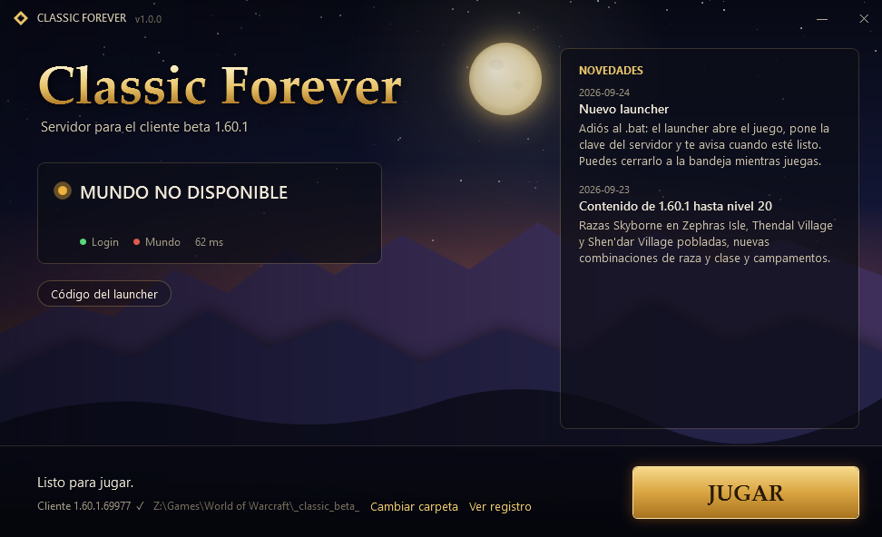

# Classic Forever Launcher

Launcher para jugar en el servidor **Classic Forever** con el cliente beta **1.60.1** (`WowB.exe`).
Sustituye a `play-beta.bat` / `Jugar-Beta.bat`: hace lo mismo, pero con una ventana, el estado del servidor
y las novedades.



## Descarga

**[Última versión → Releases](https://github.com/defexnicolas/wow-classic-launcher/releases/latest)** — descarga
`ClassicForever.exe` y ponlo donde quieras (si lo pones dentro de la carpeta `_classic_beta_`, la encuentra solo).

Requisitos: Windows 10 u 11 (trae .NET Framework 4.8 de serie), el cliente beta instalado desde Battle.net
(build `1.60.1.69913` o `1.60.1.69977`) y una cuenta en el servidor. No pide permisos de administrador.

### "Windows protegió su PC"

El ejecutable **no está firmado** (un certificado de firma cuesta cientos de dólares al año), así que SmartScreen
avisa la primera vez: pulsa **Más información → Ejecutar de todas formas**.

Para que no tengas que fiarte de nosotros:

- El `.exe` de cada release lo compila **GitHub Actions** a partir del código de este repo; el enlace al registro
  del build y el **SHA-256** están en las notas de la release. Compruébalo con
  `Get-FileHash ClassicForever.exe` en PowerShell.
- Puedes compilarlo tú: `build.cmd` usa el compilador de C# que ya trae Windows. No hace falta instalar nada.
- Es .NET sin ofuscar: cualquier descompilador (ILSpy, dnSpy) muestra el mismo código que hay aquí.

## Qué hace (y qué no)

Al pulsar **JUGAR**:

1. Crea o actualiza `WTF\BetaSuspendedTest.wtf` con `SET portal "auth.gpon.com.co"` (copia tu `Config.wtf` la
   primera vez, para conservar tus gráficos y tu sonido). **Tu `Config.wtf` no se toca**: abrir el juego desde
   Battle.net sigue yendo al beta oficial.
2. Abre `WowB.exe -config BetaSuspendedTest.wtf`.
3. Espera a que el cliente prepare la conexión y **sustituye en su memoria una clave pública** (32 bytes, la del
   grupo de región 8) por la clave pública del servidor, para que el cifrado del mundo funcione. Solo escribe si el
   almacén de claves completo coincide con el que se midió, y solo en memoria de datos (heap), nunca en código ni
   en disco. El código está en [`src/Patcher.cs`](src/Patcher.cs).
4. Se queda en la bandeja del sistema mientras juegas (reaplica la clave si el cliente la reinicia) y se cierra
   solo cuando cierras el juego.

**No** modifica ficheros del juego (salvo esa línea del `.wtf`), **no** descarga ni ejecuta nada, **no** toca otros
procesos y **no** envía datos tuyos a ningún sitio. El registro queda en `_classic_beta_\Logs\launcher.log`.

> Casi siempre entras a la primera. Si el primer intento de entrar al reino falla ("reason 24" o vuelves al
> login), espera al aviso **Listo** y vuelve a entrar **sin cerrar el juego**.

## Estado del servidor

La ventana muestra si el servidor está en línea de dos formas:

- **Sonda directa**: abre y cierra una conexión TCP con el login (`1119`) y el mundo (`8085`). Así sabe en tiempo
  real si está arriba, abajo o si solo responde el login.
- **`status.json`** en la rama [`status`](../../tree/status) de este repo: mantenimiento,
  novedades, enlaces y la última versión del launcher. Lo publica el servidor cada minuto con
  [`server/publish_status.py`](server/publish_status.py). Si tiene más de 15 minutos, el launcher no se fía de él.

Si hay una versión nueva, el launcher **solo avisa** y abre esta página: no se actualiza solo.

## Problemas

| Síntoma | Qué hacer |
|---|---|
| "No encuentro WowB.exe" | **Cambiar carpeta** y elige `_classic_beta_` (o la carpeta `World of Warcraft` que la contiene). |
| "Tu cliente es la build …" | Battle.net actualizó el cliente a un build que el servidor todavía no admite. Espera a la próxima versión. |
| "No llego desde tu red" | El servidor está en línea pero tu red no llega a `auth.gpon.com.co` (firewall, VPN, DNS). |
| Error 1023 al conectar | El portal debe ser `auth.gpon.com.co`; el launcher lo corrige solo al pulsar JUGAR. |
| El antivirus lo borra | Es un falso positivo (el launcher escribe en la memoria de otro proceso). Añade una excepción o compílalo tú. |
| Se cierra con un error | Manda `%LOCALAPPDATA%\ClassicForeverLauncher\crash.txt` y `Logs\launcher.log`. |

## Compilar

```bat
build.cmd            :: Windows: deja dist\ClassicForever.exe
```
```bash
./build.sh           # desde WSL (copia a %TEMP% y llama a build.cmd)
```

Publicar una versión: sube `App.Version` en `src/App.cs` y `launcher.version` en `server/news.json`, y empuja un
tag `vX.Y.Z`. El workflow compila, calcula el SHA-256 y crea la release.

## Para el administrador del servidor

- `server/news.json`: mantenimiento (`"maintenance": true` + `"message"`), novedades, enlaces (solo `https://`) y la
  versión publicada del launcher. Los cambios salen en el siguiente minuto.
- `server/publish_status.py --once` imprime el JSON sin publicar; `server/classic-forever-status.service` lo deja
  como servicio de usuario de systemd.

Licencia MIT. Proyecto de fans, sin relación con Blizzard Entertainment.
